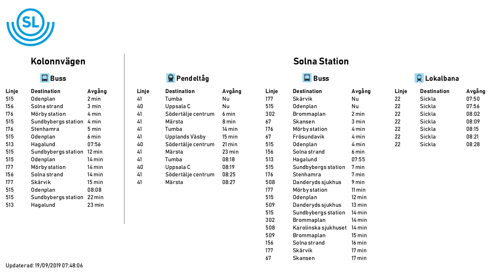
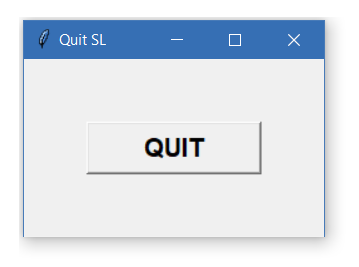
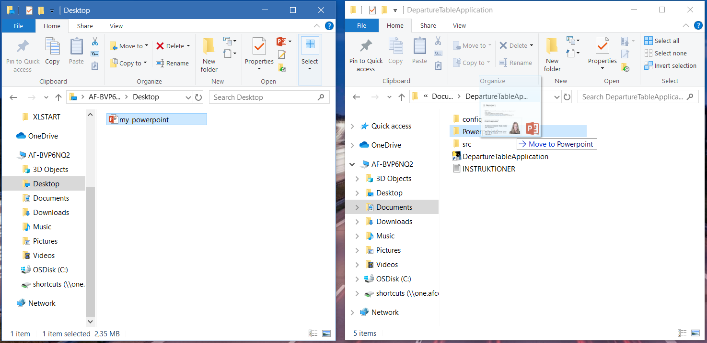
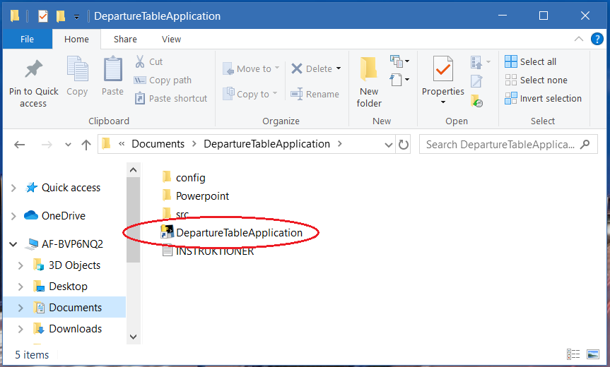
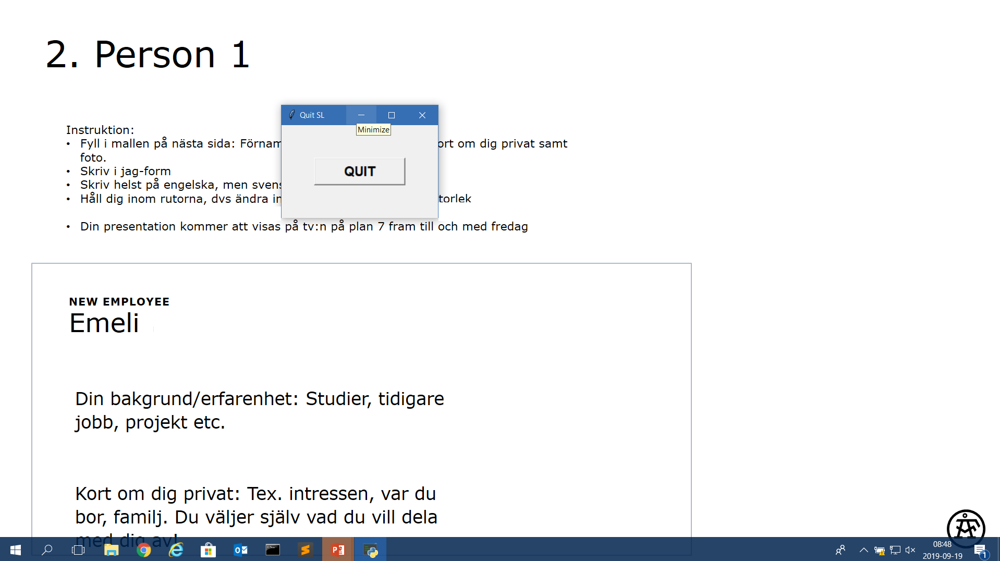
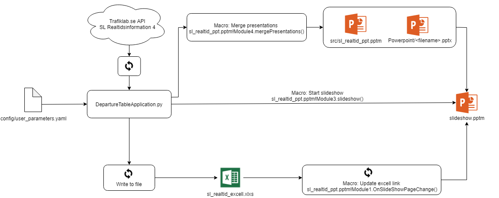

The goal of this project was to create a program that can show SL's real-time 
departure information of stations near the office. The information 
should be displayed as part of the Powerpoint presentation rolling on the TV 
screen. This way, employes that are passing by can conviniently see 
when the next bus or train is leaving.

The program was designed so that the departure tables are automatically added to a desired powerpoint together with all code keeping the tables updated. Once the code is installed and compiled on a computer, the
program can be used without any interactions with the Command Prompt or programming skills required by the user.
The program is started by a simple drag-and-drop of the desired powerpoint presentation, and then clicking on the
application symbol. Here is an example of the departure tables that are displayed during the slideshow:

To end the program, simply press the Quit button that appeared after startup:

## Example Usage
**Scenario:** You have a powerpoint presentation "my powerpoint.pptx" that you want to display as a slideshow, along with the departure table information. Note that the presentation does not have to be named my powerpoint.

**Step 1:** Naviagate to the DeparturetTableApplication folder. Drag and drop my_powerpoint in the Powerpoint folder. Make sure that my_powerpoint is the only file in the Powerpoint folder.

**Step 2:** Double-click the "DepartureTableApplication" program symbol.

**Step 3:** The slideshow of my powerpoint starts automatically with the departure tables as the last slide. Minimize the QUIT button and enjoy the show, or press QUIT to quit.

## Technical Description
#### **Trafiklab API**
The real time departure information is retrieved through the API SL Realtidsinformation 4, provided by Trafiklab.se.

Mainly five different files are involved in this program:
#### **1. DepartureTableApplication.py**
This is the main file responsible for fetching the latest departure data from the Trafiklab API, and writing this data to the excell sheet sl realtid excell.xlsx. Running this file is what starts the entire application.
#### **2. sl realtid excell.xlsx**
This document holds the latest departure information along with all formatting of the departure tables that are
displayed in powerpoint.
#### **3. sl realtid ppt.pptm**
This powerpoint contains only one slide with a chart linked to sl realtid excell.xlsx. When the excell sheet is modified, the link just have to be updated to mirror the current excell sheet.
#### **4. slideshow.pptm**
This is the final slideshow after merging the target presentation in the folder Powerpoint, with the sl realtid ppt slide
#### **5. user parameters.yaml**
YAML file where some parameters can be modified. Such as update frequency, time window for departures, API
Key etc.

Three different macros belonging to sl realtid ppt.pptm are running in the background:

##### **1. Module1:OnSlideShowPageChange()**
This function is called automatically every time the slide is changed during a slideshow. It checks which slide the show is currently on. If it is the second last slide (the slide before the departure table), it updates the link to excell to make sure the departure table has the latest information. This typically takes about 6 seconds before the slideshow can move on to the last slide.
##### **2. Module4:mergePresentations()**
This function locates the target presentation in the Powerpoint folder and merges it with sl realtid.pptm to create the new file slideshow.pptm
##### **3. Module3:slideshow()**
Set the powerpoint to loop through the slides after a certain time, and starts the slideshow.

The program works by merging the desired powerpoint presentation with another file sl realtid ppt.pptm, that contains only one slide showing the departure information. This information is linked to mirror a selected area in the excell sheet sl realtid excell. The two powerpoint files are merged into a new file called slideshow.pptm. The python script DepartureTableApplication.py fetches the latest departure information every X seconds and writes it to the excell sheet. A powerpoint macro updates the linked slide at the end of each slideshow.

## Requirements
Here are the steps needed to run this program on your Windows computer.
1. Install Python 3.6 or higher

2. Make sure the following Python packages are installed:
tkinter
openpyxl
pyYaml
pyinstaller
pywin32

3. Open src/DepartureTableApplication.py and edit the PATH to user parameters.yaml on your computer, for example
settings=yaml.safe_load(open("C:\\User\\Name\\Documents\\DepartureTableApplication
\\config\\user_parameters.yaml", 'r',encoding = 'utf-8'))

4. Open user parameters.yaml and edit the parameter working directory to the PATH of the DepartureTableApplica-
tion folder on your computer. working_directory: "C:\\User\\Name\\Documents\\DepartureTableApplication"}

5. Make sure everything works properly. Open a terminal, navigate to DepartureTableApplication/src and run Depar-
tureTableApplication.py.
$ python DepartureTableApplication.py

6. Use pyinstaller to make the code into an executable.
$ pyinstaller.exe --onefile DepartureTableApplication.py

7. Two directories, /build and /dist, have now been added in /src. In /dist you will find the executable to run the program. Move the executable , or create a shortcut to it, in the desired location.
Now the program can be used as described in the **Example Usage** section.

## Notes
The desired powerpoint presentation must be of format .pptx. Otherwise it won't be found by the merging macro.
Make sure that the Powerpoint folder contains only the desired presentation, remove any other old presentation.
Otherwise, the presentation with the alfabetically first filename will be used by the program.

The reason for hardcoding the paths as described under **Requirements**, instead of just using the current directory, is that the current directory is different depending on if you are running the python script manually, or running the executable. This can probably be done in a more convenient way.
